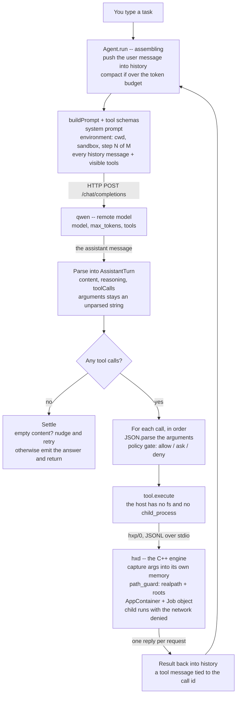
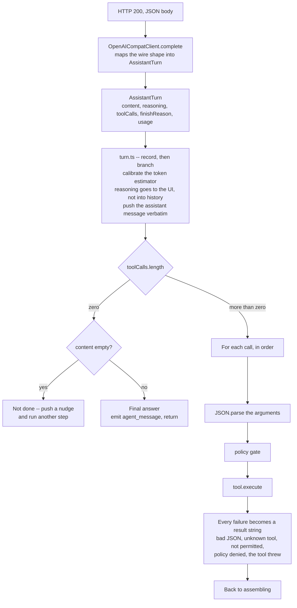
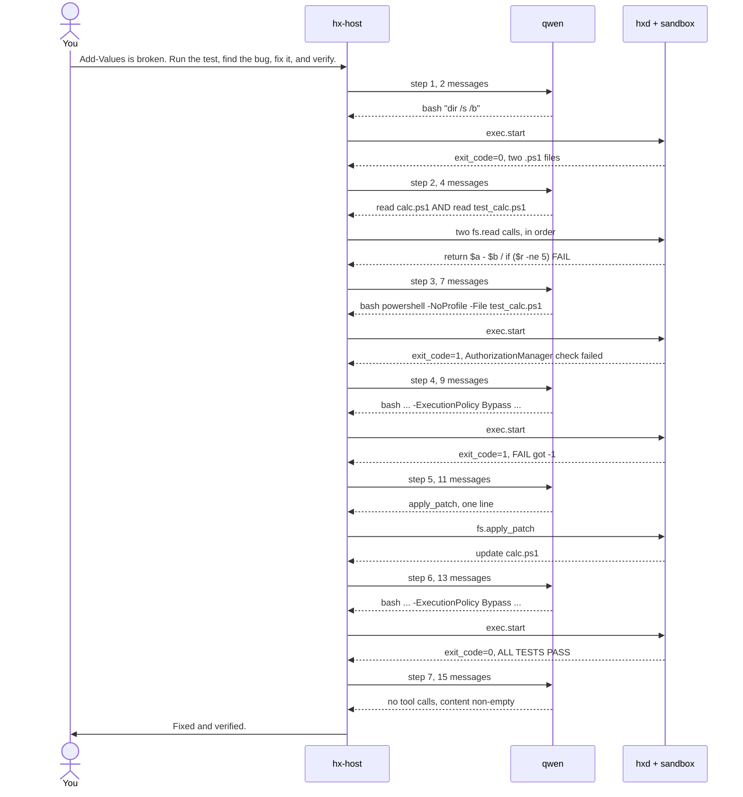

# Anatomy of a turn

*English · [中文](anatomy-of-a-turn.zh-CN.md)*

What happens between typing a task and getting an answer: how the prompt is
assembled, how the model's reply is read, and where the two privilege
boundaries sit.

The third section is not an illustration. It is one real run against a local
qwen, quoted from its rollout -- every number, command and sentence below is
verbatim. Reproduce it with `node scripts/transcript.mjs`.

---

## 1. One turn, end to end



**The host cannot do anything itself.** It crosses a boundary twice per step:
outward over HTTP to the model, and downward over hxp to the engine.
`test/arch.sh` forbids `node:fs` and `node:child_process` anywhere in
`host/src` except the one file that spawns the engine, so the `bash` tool does
not run a command -- it sends `engine.execStart(...)` and waits. That is what
makes "the host is userland relative to the engine" a fact rather than a
slogan.

**path_guard sits before the sandbox, and that is not redundant.** `fs.read`
and `fs.apply_patch` never pass through AppContainer at all: the engine
executes them itself, and the engine is the kernel here -- it is not inside the
sandbox. The only thing stopping `fs.read ../../etc/shadow` is path_guard.
AppContainer constrains the *child process* that `bash` starts. Under
`danger-full-access` the AppContainer line disappears and path_guard remains.

**The loop is why prompts grow.** Control returns to assembling and
`buildPrompt()` reassembles from a longer history. Step N's prompt contains
everything from steps 1..N-1, which is why recording prompts costs O(n²) --
see `HX_LOG_PROMPTS` in the [README](../README.md).

---

## 2. How the model's reply is read



### `arguments` stays a string until turn.ts

The client maps shapes and nothing else; it never touches `arguments`
(`host/src/model/openai_compat.ts`):

```ts
toolCalls: (msg.tool_calls ?? []).map((t) => ({
  id: t.id || `call_${t.function.name}_${...}`,   // llama.cpp returns no id
  name: t.function.name,
  argumentsJson: t.function.arguments,             // verbatim, not parsed
}))
```

`JSON.parse` happens in the execution loop instead, inside a `try`
(`host/src/loop/turn.ts`):

```ts
try { args = JSON.parse(call.argumentsJson || "{}"); }
catch {
  content = `invalid JSON arguments for ${call.name}`;
  this.#pushToolResult(call.id, content);
  continue;
}
```

Models emit malformed JSON regularly. Parsed in the client, that is an
exception thrown through the whole turn loop; parsed here, it becomes an
ordinary tool result the model reads and retries from.

### Nothing throws out of the execution loop

Six different failures, six result strings fed back:

| What happened | What the model is told |
|---|---|
| Interrupted | `aborted by user before execution` |
| No such tool | `unknown tool: X` |
| Not in allowedTools | `tool X is not permitted in this session` |
| `arguments` is not JSON | `invalid JSON arguments for X` |
| Policy denied, or ask refused | the denial message |
| The tool threw | `tool X failed: <message>` |

### Empty content is not an answer

A reasoning model can spend its whole budget thinking and return empty
`content`. That means truncated, not finished, so the loop nudges and
continues rather than returning an empty string as the final answer -- with
different wording depending on `finish_reason`:

```ts
if (text.trim() === "") {
  this.#history.push({ role: "user", content: assistant.finishReason === "length"
    ? "Your reply was cut off before any answer. ..."
    : "You returned an empty reply. ..." });
  continue;
}
```

### What crosses which boundary

| | Fed back to the model | Shown to people |
|---|---|---|
| `content` | yes | yes, as `agent_message` |
| `toolCalls` | yes, **verbatim** | yes, as items |
| `reasoning` | **no** | yes |

`toolCalls` must be echoed back or the model cannot see what it just called and
repeats it. `reasoning` is never fed back -- so a conclusion the model reaches
in its thinking is gone by the next step unless it also wrote it into `content`
or into a file.

---

## 3. A real turn, quoted from the rollout

Local qwen3.8-27b-uncensored, workspace-write, network denied, `-Approval auto`.
Task: a PowerShell function that subtracts where it should add.



### The steps, verbatim

| Step | msgs in | tok out | latency | Tool call | Result |
|---:|---:|---:|---:|---|---|
| 1 | 2 | 48 | 1.05s | `bash dir /s /b` | `exit_code=0`, two files |
| 2 | 4 | 65 | 1.13s | `read calc.ps1` + `read test_calc.ps1` | `return $a - $b` |
| 3 | 7 | 67 | 1.16s | `bash powershell -NoProfile -File test_calc.ps1` | `exit_code=1` AuthorizationManager |
| 4 | 9 | 78 | 1.30s | `bash powershell -NoProfile -ExecutionPolicy Bypass -File test_calc.ps1` | `exit_code=1` `FAIL: got -1` |
| 5 | 11 | 151 | 2.22s | `apply_patch` `-  $a - $b` / `+  $a + $b` | `update calc.ps1` |
| 6 | 13 | 76 | 1.28s | same command as step 4 | `exit_code=0` `ALL TESTS PASS` |
| 7 | 15 | 193 | 2.88s | none | `final_message` |

The model's own reasoning at each step, verbatim:

> 1. "Let's start by exploring the workspace to find the Add-Values test."
> 2. "Let's take a look at both files."
> 3. "The bug is obvious: `Add-Values` is using `-` instead of `+`. Let's run the tests first to confirm."
> 4. "PowerShell execution policy issue. Let's try -ExecutionPolicy Bypass."
> 5. "Found a bug: `Add-Values` is doing `$a - $b` (subtraction) instead of `$a + $b` (addition). 2 - 3 = -1. Fix it and verify."
> 6. "Alright, let's verify. Also, note that the execution policy issue is an environmental factor. The test passed with Bypass. Let's re-run it."
> 7. "Done. The test is passing now. Let me report back."

### What the real numbers show

**Messages go 2, 4, 7, 9, 11, 13, 15.** Every step adds 2 except step 2 to
step 3, which adds 3 -- because step 2 emitted *two* `read` calls at once, so
one assistant message and two tool results came back. Tool calls arrive in
parallel; the execution loop runs them in order and only then reassembles.

**Step 3 already knew the answer and ran the test anyway.** The system prompt
says "Prefer small, verifiable steps: inspect first, change second, verify
third", and it followed that. The cost was two extra steps. The gain was that
step 4's `FAIL: got -1` is a checkable fact rather than the model's opinion.

**Steps 3 and 4 are two different kinds of failure with the same exit code.**

| | exit | Output | What it is |
|---|---:|---|---|
| step 3 | 1 | `AuthorizationManager check failed.` | the environment -- the execution policy blocked the script before any code ran |
| step 4 | 1 | `FAIL: got -1` | the actual bug |

Telling them apart requires reading the output, not the exit code. This is also
why a failing tool must be fed back rather than thrown: thrown, the turn would
have ended on an environment problem unrelated to the task.

**The output-token shape marks the real work**: 48, 65, 67, 78, **151**, 76,
**193**. The two peaks are the only two steps that produced something -- the
patch and the final report. Everything else is "look, decide, next". Latency
tracks it: 1.0-1.3s cruising, 2.2s and 2.9s at the peaks.

**It reported an obstacle nobody asked about.** The final answer carries a note
that the test fails under the default execution policy and needs
`-ExecutionPolicy Bypass` -- an environmental problem it had already worked
around and that had nothing to do with the task. It surfaced it instead of
quietly swallowing it.

---

## Reproducing this

```bash
node scripts/transcript.mjs --list      # what sessions exist
node scripts/transcript.mjs s6468       # one session as a transcript
node scripts/transcript.mjs s6468 --full
```

A rollout records the conversation, not the prompt. To capture what the model
was actually sent, run with prompt logging on and read it back:

```bash
HX_LOG_PROMPTS=1 hx "..."
node scripts/transcript.mjs --prompts
```

That is where section 3's message counts, token totals and latencies come
from. It is off by default because of the O(n²) growth described above --
measured, a 7-step run's rollout went from 6 KB to 50 KB, with prompts at 87%
of it.
