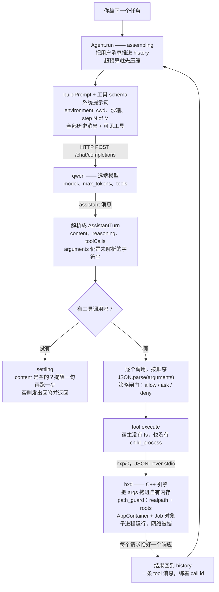
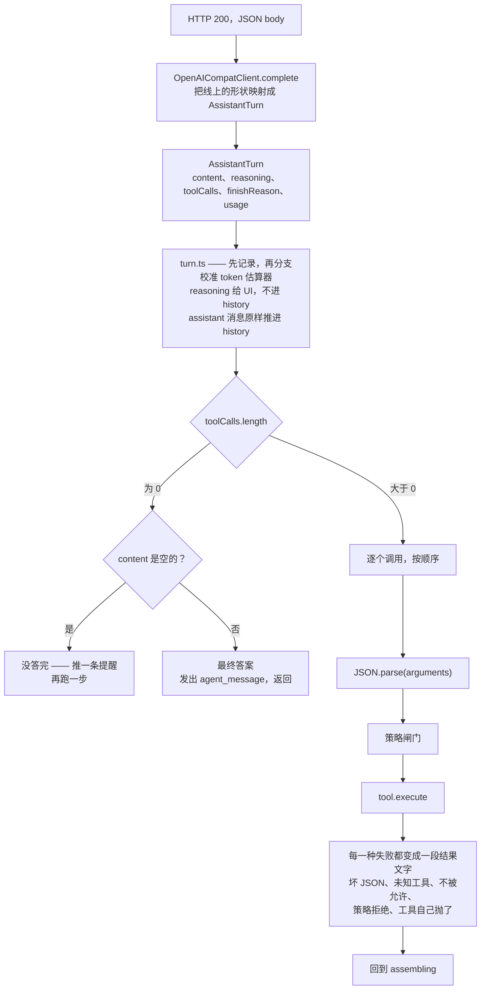
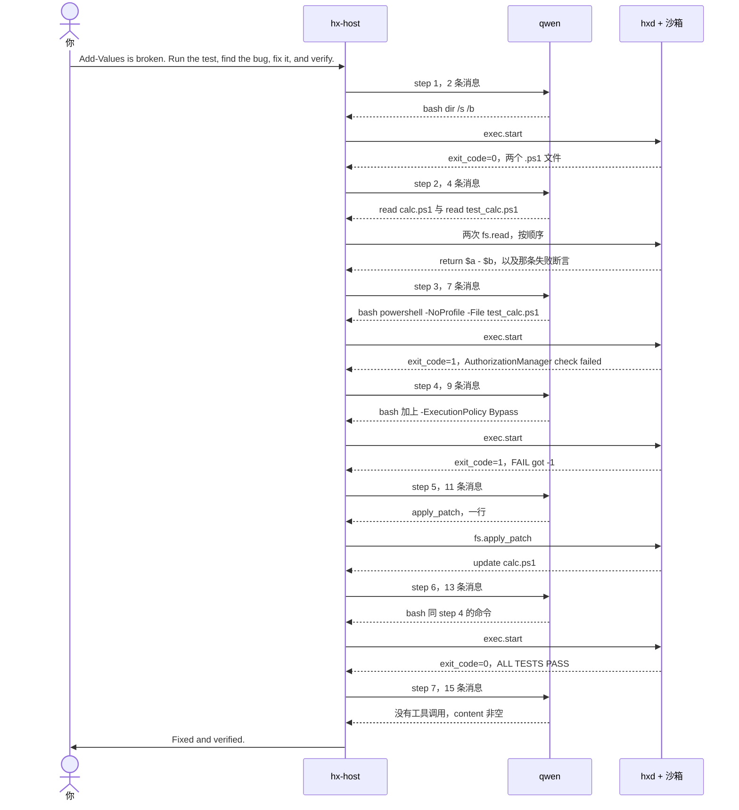

# 一轮的解剖

*[English](anatomy-of-a-turn.md) · 中文*

从你敲下任务到拿到回答之间发生了什么：提示词怎么装配、模型的回复怎么被读取、
两条特权边界在哪。

第三节不是示意图。它是对着本地 qwen 真跑的一次，从 rollout 里逐字取出来的——
下面每一个数字、命令、句子都是原文。自己复现：`node scripts/transcript.mjs`。

---

## 1. 一轮的全貌



**宿主自己什么都做不了。** 每一步它要出圈两次：向外用 HTTP 找模型，向下用 hxp 找引擎。
`test/arch.sh` 禁止 `host/src` 里出现 `node:fs` 和 `node:child_process`（只豁免那个
拉起引擎的文件），所以 `bash` 工具并不跑命令——它发出 `engine.execStart(...)` 然后等。
这就是"宿主相对引擎就是用户态"能成立的原因：不是约定，是它真的没有那个能力。

**path_guard 在沙箱之前，而且不冗余。** `fs.read` 和 `fs.apply_patch` 根本不经过
AppContainer：它们由引擎自己执行，而引擎就是这里的"内核"，它不在沙箱里。挡住
`fs.read ../../etc/shadow` 的**只有** path_guard。AppContainer 约束的是 `bash` 起的
**子进程**。`danger-full-access` 下 AppContainer 那条没了，path_guard 还在。

**这个回环就是提示词变长的原因。** 控制权回到 assembling，`buildPrompt()` 拿更长的
history 重新装配。第 N 步的提示词包含第 1..N-1 步的全部内容——这就是记录提示词
代价是 O(n²) 的由来，见 [README](../README.zh-CN.md) 里的 `HX_LOG_PROMPTS`。

---

## 2. 模型的回复是怎么被读取的



### `arguments` 一路是字符串，直到 turn.ts

客户端只做形状映射，**不碰 `arguments`**（`host/src/model/openai_compat.ts`）：

```ts
toolCalls: (msg.tool_calls ?? []).map((t) => ({
  id: t.id || `call_${t.function.name}_${...}`,   // llama.cpp 不回 id
  name: t.function.name,
  argumentsJson: t.function.arguments,             // 原样，不 parse
}))
```

`JSON.parse` 推迟到执行循环里，而且包在 `try` 中（`host/src/loop/turn.ts`）：

```ts
try { args = JSON.parse(call.argumentsJson || "{}"); }
catch {
  content = `invalid JSON arguments for ${call.name}`;
  this.#pushToolResult(call.id, content);
  continue;
}
```

模型吐坏 JSON 是常事。放在客户端解析，那就是一个异常穿过整个 turn 循环；
放在这里，它变成一条普通的工具结果，模型读到之后自己重发。

### 执行循环里没有任何一条路径会抛出去

六种失败，六段喂回去的文字：

| 发生了什么 | 模型看到的 |
|---|---|
| 被中断 | `aborted by user before execution` |
| 工具不存在 | `unknown tool: X` |
| 不在 allowedTools 里 | `tool X is not permitted in this session` |
| `arguments` 不是 JSON | `invalid JSON arguments for X` |
| 策略拒绝，或 ask 被拒 | 那条拒绝消息 |
| 工具自己抛了 | `tool X failed: <message>` |

### 空的 content 不是答案

推理模型可能把预算全花在思考上，`content` 是空的。那是**被截断**，不是"答完了"。
所以循环会提醒一句再继续，而不是把空串当成最终答案返回——而且按 `finish_reason`
给不同的措辞：

```ts
if (text.trim() === "") {
  this.#history.push({ role: "user", content: assistant.finishReason === "length"
    ? "Your reply was cut off before any answer. ..."
    : "You returned an empty reply. ..." });
  continue;
}
```

### 什么越过哪条边界

| | 喂回模型 | 给人看 |
|---|---|---|
| `content` | 是 | 是，作为 `agent_message` |
| `toolCalls` | 是，**原样** | 是，作为 item |
| `reasoning` | **否** | 是 |

`toolCalls` 必须原样回灌，否则模型看不见自己刚调过什么，会重复调。
`reasoning` 从不回灌——所以模型在思考里得出的结论，到下一步就没了，
除非它同时写进了 `content` 或某个文件。

---

## 3. 一轮真实的运行，逐字取自 rollout

本地 qwen3.8-27b-uncensored，workspace-write，网络禁止，`-Approval auto`。
任务：一个该做加法却做了减法的 PowerShell 函数。



### 七步原文

| 步 | 入消息 | 出 token | 延迟 | 工具调用 | 结果 |
|---:|---:|---:|---:|---|---|
| 1 | 2 | 48 | 1.05s | `bash dir /s /b` | `exit_code=0`，两个文件 |
| 2 | 4 | 65 | 1.13s | `read calc.ps1` + `read test_calc.ps1` | `return $a - $b` |
| 3 | 7 | 67 | 1.16s | `bash powershell -NoProfile -File test_calc.ps1` | `exit_code=1` AuthorizationManager |
| 4 | 9 | 78 | 1.30s | `bash powershell -NoProfile -ExecutionPolicy Bypass -File test_calc.ps1` | `exit_code=1` `FAIL: got -1` |
| 5 | 11 | 151 | 2.22s | `apply_patch` `-  $a - $b` / `+  $a + $b` | `update calc.ps1` |
| 6 | 13 | 76 | 1.28s | 同第 4 步的命令 | `exit_code=0` `ALL TESTS PASS` |
| 7 | 15 | 193 | 2.88s | 无 | `final_message` |

模型每一步的 reasoning 原文：

> 1. "Let's start by exploring the workspace to find the Add-Values test."
> 2. "Let's take a look at both files."
> 3. "The bug is obvious: `Add-Values` is using `-` instead of `+`. Let's run the tests first to confirm."
> 4. "PowerShell execution policy issue. Let's try -ExecutionPolicy Bypass."
> 5. "Found a bug: `Add-Values` is doing `$a - $b` (subtraction) instead of `$a + $b` (addition). 2 - 3 = -1. Fix it and verify."
> 6. "Alright, let's verify. Also, note that the execution policy issue is an environmental factor. The test passed with Bypass. Let's re-run it."
> 7. "Done. The test is passing now. Let me report back."

### 这些真实数字说明了什么

**消息数是 2、4、7、9、11、13、15。** 每步 +2，只有第 2 步到第 3 步 +3——因为第 2 步
一次发了**两个** `read`，于是回来 1 条 assistant + 2 条 tool。工具调用可以并发发出，
执行循环顺序跑完才重新装配。

**第 3 步已经知道答案了，还是先跑了测试。** 系统提示词里写着 "Prefer small, verifiable
steps: inspect first, change second, verify third"，它在照做。代价是多花两步，
收益是第 4 步的 `FAIL: got -1` 是一个可复核的事实，而不是模型的判断。

**第 3、4 步是两种不同的失败，退出码一样。**

| | 退出码 | 输出 | 是什么 |
|---|---:|---|---|
| step 3 | 1 | `AuthorizationManager check failed.` | 环境问题——执行策略挡住了脚本，根本没跑到代码 |
| step 4 | 1 | `FAIL: got -1` | 真正的 bug |

分辨它们要读输出内容，不是看退出码。这也是工具失败必须喂回去而不是抛出去的原因：
抛了的话，整轮会结束在一个跟任务无关的环境问题上。

**出力 token 的形状标出了真正的工作**：48、65、67、78、**151**、76、**193**。
两个峰值恰好是唯二产出了东西的两步——补丁和最终报告。其余都是"看一眼，下一步"。
延迟也跟着：1.0–1.3s 的巡航，到 2.2s 和 2.9s 两个峰。

**它报告了一个没人问的障碍。** 最终答案里带了一句：默认执行策略下测试会失败，
需要 `-ExecutionPolicy Bypass`——那是一个它自己已经绕过去了、且与任务无关的环境问题。
它把它摆出来了，而不是悄悄吞掉。

---

## 怎么复现

```bash
node scripts/transcript.mjs --list      # 有哪些会话
node scripts/transcript.mjs s6468       # 某个会话的对话记录
node scripts/transcript.mjs s6468 --full
```

rollout 记的是对话，不是提示词。要抓到**实际发给模型的东西**，开着提示词日志跑，
再读回来：

```bash
HX_LOG_PROMPTS=1 hx "..."
node scripts/transcript.mjs --prompts
```

第 3 节里的消息数、token 数和延迟就是这么来的。它默认关着，原因是上面说的 O(n²)——
实测 7 步的会话 rollout 从 6 KB 涨到 50 KB，提示词占其中 87%。
